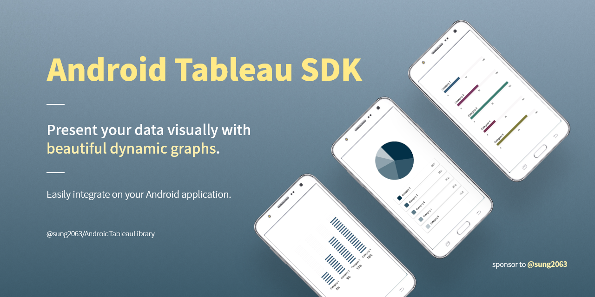
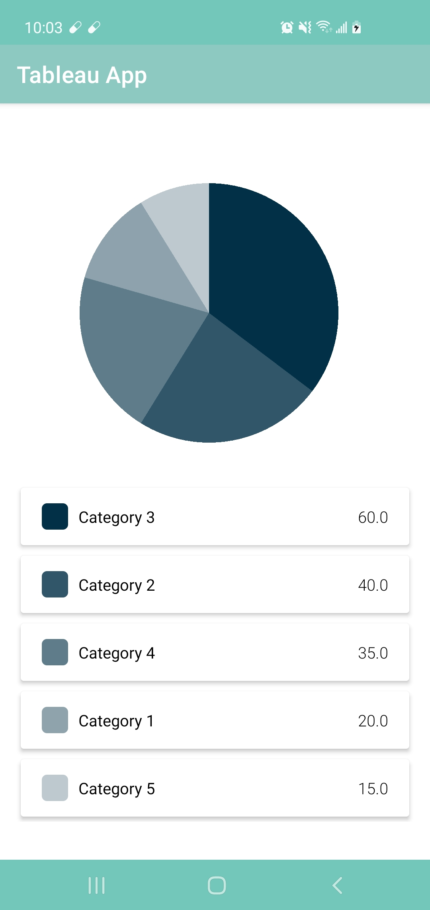
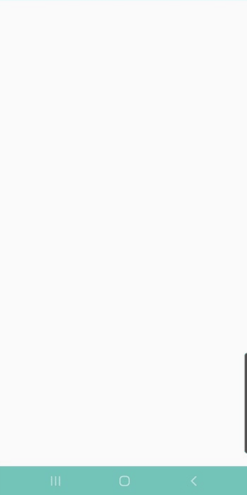

# Android Tableau Library



[](https://jitpack.io/#sung2063/AndroidTableauLibrary)

Android Tableau library supports variety of graphs which developers simply integrate visualization reports on Android application.

## 💖 Sponsor

Android Tableau library updates regularly. Your valueable sponsorship helps me contributing more features and maintaining the library. Click heart button below to sponsor me!

[](https://github.com/sponsors/sung2063)

## 🆕 Latest Update

Updated on <i>May 19th 2021</i>
- <b>NEW</b>: PieGraphView, DotProgressView, and LinearProgressView are released! ✨

Updated on <i>May 20th 2021</i>
- Improve codes from v1.0-rc-1

## 📖 Usage Instruction

<b>1. Setup your Android project setting</b>

Minimum SDK Version: 21 or greater (Update in your <i>app level</i> `build.gradle`)<br/>
Supported Programming Language: Kotlin

Add following snippet code in your <i>project level</i> `build.gradle`.
```gradle
android {
    compileOptions {
        sourceCompatibility JavaVersion.VERSION_1_8
        targetCompatibility JavaVersion.VERSION_1_8
    }
}
```

<b>2. Add required library</b>

First, include following jitpack url inside maven block in your <i>project level</i> `build.gradle`.
```gradle
allprojects {
    repositories {
        ...
        maven { url 'https://jitpack.io' }
    }
}
```

Next, add the TableauViews and required libraries in <i>app level</i> `build.gradle` and sync the gradle file. 
```gradle
implementation 'com.github.sung2063:AndroidTableauLibrary:1.0-rc-2'
implementation 'com.google.android.material:material:1.3.0'
```

Now you are ready to use Tableau Library. You can start creating graph and progress views.<br/>

<hr/>

### *PieGraphView*



First, create a PieGraphView in your xml file.
```xml
<com.sung2063.tableau_library.graph.PieGraphView
        android:id="@+id/pie_graph_view"
        android:layout_width="match_parent"
        android:layout_height="match_parent" />
```

Next, in your `onCreate()` method in Activity, create an arrrylist that holds PieGraphModel objects, pass list to new PieGraphHandler object, and set this to pieGraphView handler.
 
```kotlin
val pieGraphView: PieGraphView = findViewById(R.id.pie_graph_view)

// Create ArrayList<PieGraphModel> object...

val handler = PieGraphHandler(dataList)
pieGraphView.setHandler(handler)
```

Your pie graph with list of data is displayed on your app! 👏<br/>

<hr/>

### *DotProgressView*


First, create a DotProgressView in your xml file.
```xml
<com.sung2063.tableau_library.progress.DotProgressView
        android:id="@+id/dot_progress_view"
        android:layout_width="match_parent"
        android:layout_height="match_parent" />
```

Next, in your `onCreate()` method in Activity, create an mutableList that holds DotProgressModel objects, pass list to new DotProgressHandler object, and set this to dotProgressView handler.
 
```kotlin
val dotProgressView: DotProgressView = findViewById(R.id.dot_progress_view)

// Create MutableList<DotProgressModel> object...

val handler = DotProgressHandler(dataList)
dotProgressView.setHandler(handler)
```

Your dot progress graph with list of data is displayed on your app! 👏<br/>

<hr/>

### *LinearProgressView*



First, create a LinearProgressView in your xml file.
```xml
<com.sung2063.tableau_library.progress.LinearProgressView
        android:id="@+id/linear_progress_view"
        android:layout_width="match_parent"
        android:layout_height="match_parent" />
```

Next, in your `onCreate()` method in Activity, create an mutableList that holds LinearProgressModel objects, pass list to new LinearProgressHandler object, and set this to linearProgressView handler.
 
```kotlin
val linearProgressView: LinearProgressView = findViewById(R.id.linear_progress_view)

// Create MutableList<LinearProgressModel> object...

val handler = LinearProgressHandler(dataList)
linearProgressView.setHandler(handler)
```

Your linear progress graph with list of data is displayed on your app! 👏<br/><br/>


## 🎨 Attributions

Here are available attributions you can use to customize your tableau views.

### PieGraphView

<center>
  <table>
    <tr>
      <th>Attribution</th>
      <th>Value</th>
      <th>Description</th>
    </tr>
    <tr>
      <td>useArcColor</td>
      <td>boolean</td>
      <td>Use each object's arc color if the value true, otherwise use default color.</td>
    </tr>
    <tr>
      <td>graphColor</td>
      <td>string</td>
      <td>User choose default graph color. This applies only when useArcColor attribution is false.</td>
   </tr>
  </table>
</center>

### DotProgressView

<center>
  <table>
    <tr>
      <th>Attribution</th>
      <th>Value</th>
      <th>Description</th>
    </tr>
    <tr>
      <td>useCommonColor</td>
      <td>boolean</td>
      <td>Use all progress same color if the value true, otherwise use own progress color which set on each objects.</td>
    </tr>
    <tr>
      <td>filledColor</td>
      <td>string</td>
      <td>Hex color code for progress. This applies only when useCommonColor attribution is true.</td>
   </tr>
   <tr>
      <td>unfilledColor</td>
      <td>string</td>
      <td>Hex color code for scale line.</td>
   </tr>
  </table>
</center>

### LinearProgressView

<center>
  <table>
    <tr>
      <th>Attribution</th>
      <th>Value</th>
      <th>Description</th>
    </tr>
    <tr>
      <td>useCommonColor</td>
      <td>boolean</td>
      <td>Use all progress same color if the value true, otherwise use own progress color which set on each objects.</td>
    </tr>
    <tr>
      <td>filledColor</td>
      <td>string</td>
      <td>Hex color code for progress. This applies only when useCommonColor attribution is true.</td>
   </tr>
   <tr>
      <td>unfilledColor</td>
      <td>string</td>
      <td>Hex color code for scale line.</td>
   </tr>
   <tr>
      <td>maxValue</td>
      <td>integer</td>
      <td>The maximum value for progress.</td>
   </tr>
  </table>
</center>

## 📝 License
 
 The code is licensed under the <a href="https://github.com/sung2063/AndroidTableauLibrary/blob/master/LICENSE">MIT License</a>.

 ## 🌟 Contributors
 
 <b>Developer</b>: <i>Sung Hyun Back (@sung2063)</i>
 
 <b>Designer</b>: <i>Da Eun Park</i>
